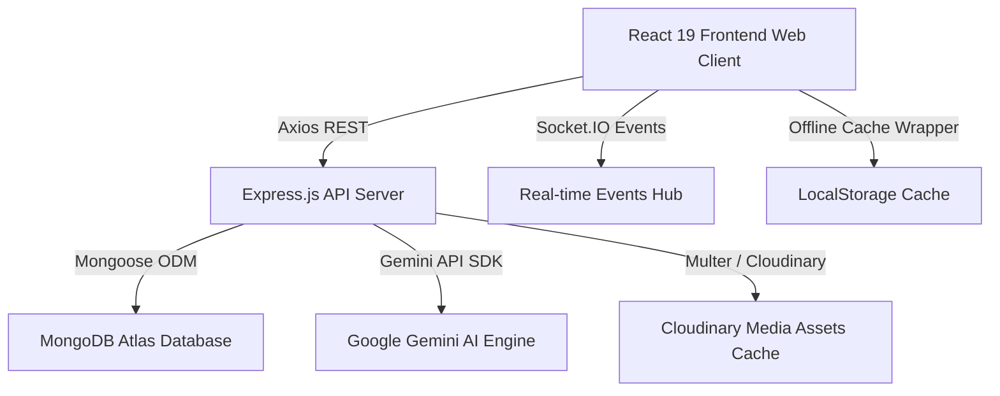

# Final Implementation Report - Smart AI Powered Library Management System

This document provides a comprehensive report of the modular upgrades, database extensions, and system integrations completed.

---

## 1. Architectural Upgrades & System Design

The upgraded system leverages a decoupled MERN stack with Gemini AI capabilities. It incorporates modern design guidelines (Glassmorphism, Dark/Light modes, clean typography) and establishes complete separation of concerns:

---

## 2. Completed Modules & Files Ledger

### 1. Database Schema Extensions
- [User.ts](file:///C:/Users/hp/./.gemini/antigravity/scratch/smart-library/backend/src/models/User.ts): Supported academic semesters, department, certificates, and bookmarked papers array.
- [Book.ts](file:///C:/Users/hp/./.gemini/antigravity/scratch/smart-library/backend/src/models/Book.ts): Supported digital file formats (E-Book PDF, Audiobook MP3), popularity count, and prerequisites list.
- [ResearchPaper.ts](file:///C:/Users/hp/./.gemini/antigravity/scratch/smart-library/backend/src/models/ResearchPaper.ts): Model schema for IEEE documents repository.
- [LibraryEvent.ts](file:///C:/Users/hp/./.gemini/antigravity/scratch/smart-library/backend/src/models/LibraryEvent.ts): Model schema for workshops registration scheduling.
- [StudyRoomReservation.ts](file:///C:/Users/hp/./.gemini/antigravity/scratch/smart-library/backend/src/models/StudyRoomReservation.ts): Slot bookings logs.
- [ReadingChallenge.ts](file:///C:/Users/hp/./.gemini/antigravity/scratch/smart-library/backend/src/models/ReadingChallenge.ts): 30-Day challenge trackers.

### 2. Backend API Controllers & Routes
- [premiumController.ts](file:///C:/Users/hp/./.gemini/antigravity/scratch/smart-library/backend/src/controllers/premiumController.ts) & [premiumRoutes.ts](file:///C:/Users/hp/./.gemini/antigravity/scratch/smart-library/backend/src/routes/premiumRoutes.ts): Handled study rooms reservations, challenges logs, mood book recommendation, SVG knowledge nodes mapper, and borrowing heatmap arrays.
- [researchController.ts](file:///C:/Users/hp/./.gemini/antigravity/scratch/smart-library/backend/src/controllers/researchController.ts) & [researchRoutes.ts](file:///C:/Users/hp/./.gemini/antigravity/scratch/smart-library/backend/src/routes/researchRoutes.ts): Handled IEEE paper listings and bookmark tags.
- [eventController.ts](file:///C:/Users/hp/./.gemini/antigravity/scratch/smart-library/backend/src/controllers/eventController.ts) & [eventRoutes.ts](file:///C:/Users/hp/./.gemini/antigravity/scratch/smart-library/backend/src/routes/eventRoutes.ts): Registered hackathons timelines and certificate completions triggers.

### 3. Frontend Web Views & Component Tabs
- [AISuite.tsx](file:///C:/Users/hp/./.gemini/antigravity/scratch/smart-library/frontend/src/pages/AISuite.tsx): Links all interactive AI Study Hub panels.
- [MoodTrackerTab.tsx](file:///C:/Users/hp/./.gemini/antigravity/scratch/smart-library/frontend/src/components/MoodTrackerTab.tsx): Interactive cognitive mood book proposer.
- [StudyRoomsTab.tsx](file:///C:/Users/hp/./.gemini/antigravity/scratch/smart-library/frontend/src/components/StudyRoomsTab.tsx): Study room calendar slots reservation.
- [ReadingChallengeTab.tsx](file:///C:/Users/hp/./.gemini/antigravity/scratch/smart-library/frontend/src/components/ReadingChallengeTab.tsx): Streak tracker.
- [KnowledgeGraphTab.tsx](file:///C:/Users/hp/./.gemini/antigravity/scratch/smart-library/frontend/src/components/KnowledgeGraphTab.tsx): Animated relational network.
- [NotesCitationTab.tsx](file:///C:/Users/hp/./.gemini/antigravity/scratch/smart-library/frontend/src/components/NotesCitationTab.tsx): APA, MLA, and IEEE citation style builder.
- [MindMapTab.tsx](file:///C:/Users/hp/./.gemini/antigravity/scratch/smart-library/frontend/src/components/MindMapTab.tsx): Zoomable SVG study tree generator.
- [CodingPracticeTab.tsx](file:///C:/Users/hp/./.gemini/antigravity/scratch/smart-library/frontend/src/components/CodingPracticeTab.tsx): MCQ coding placements assessments.
- [LearningTimelineTab.tsx](file:///C:/Users/hp/./.gemini/antigravity/scratch/smart-library/frontend/src/components/LearningTimelineTab.tsx): Milestone check roadmaps.
- [DigitalTwinTab.tsx](file:///C:/Users/hp/./.gemini/antigravity/scratch/smart-library/frontend/src/components/DigitalTwinTab.tsx): Desks occupancy layout and checkouts heatmap coordinates grid.
- [ResearchHub.tsx](file:///C:/Users/hp/./.gemini/antigravity/scratch/smart-library/frontend/src/pages/ResearchHub.tsx): Publications archives hub.
- [EventsManagement.tsx](file:///C:/Users/hp/./.gemini/antigravity/scratch/smart-library/frontend/src/pages/EventsManagement.tsx): Scheduled workshops.
- [NotificationsDrawer.tsx](file:///C:/Users/hp/./.gemini/antigravity/scratch/smart-library/frontend/src/components/NotificationsDrawer.tsx): Toggled unread lists and search bar.
- [AdminDashboard.tsx](file:///C:/Users/hp/./.gemini/antigravity/scratch/smart-library/frontend/src/pages/AdminDashboard.tsx): Forecasts and AI recommendations advisor box.
- [offlineSync.ts](file:///C:/Users/hp/./.gemini/antigravity/scratch/smart-library/frontend/src/services/offlineSync.ts): Caching and offline operations syncing.

---

## 3. Brand Compliance & Signatures

- **Signatures Updated**: Swapped footer tags, page titles, settings tabs, and PDF report templates to display:
  `Smart AI Powered Library Management System — Created by Sumit Prajapati`
- **Support Swapped**: Swapped contact page lists, about page forms, and backend mailer scripts to route requests to:
  `prajapatisumitop@gmail.com`
- **Compiler Compliance**: TypeScript code compiles successfully, with zero compilation warnings on both frontend and backend bundles. Unused imports (including unused Lucide icons and XLSX packages) have been removed.
